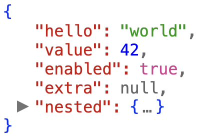

# `<pretty-json>` HTML Custom Element

> Development in progress. Not ready for use.

`<pretty-json>` is an HTML custom element that allows you to render JSON objects in HTML documents with human-readable formatting and expandable interaction for browsing deep JSON structures.

## Usage

Include [`pretty-json.js`](https://github.com/mohsen1/pretty-json/blob/main/src/index.js) in your HTML page and use the HTML custom element as follows:

<!-- prettier-ignore-start -->
```html
<pretty-json>{
  "hello": "world",
  "value": 42,
  "enabled": true,
  "extra": null,
  "nested": { "key": "value" }
}</pretty-json>
````

<!-- prettier-ignore-end -->

Your JSON will be rendered as a human-readable format:



## Features

- Outputs a valid JSON string that can be copied and pasted into a JSON file
- HTML Custom Element without any dependencies, works in any modern browser
- No need to install any dependencies or build tools, just drop the script in your HTML and start using it
- Allows a high level of customization using CSS variables
- Display large JSON objects with expandable and collapsible sections
- Supports truncating very large strings and arrays with an ellipsis

## To-do List

- [ ] Support clicking on strings that are links
- [ ] Support truncating very large strings
- [ ] Support grouping very large arrays

## Attributes

You can customize the rendering of the JSON object by setting the following attributes on the `<pretty-json>` element:

### `expand`

By default, the JSON object is rendered expanded up to 1 level deep. You can set the `expand` attribute to a number to expand the JSON object up to that level deep:

```html
<pretty-json expand="2">{"hello": {"world": "!"}}</pretty-json>
```

#### Collapsed by default

You can set the `expand` attribute to `0` to render the JSON object collapsed by default:

```html
<pretty-json expand="0">{"hello": {"world": "!"}}</pretty-json>
```

## Customization

You can customize the appearance of the rendered JSON using CSS variables:

```css
pretty-json {
  --key-color: #c00;
  --arrow-color: #737373;
  --brace-color: #0030f0;
  --bracket-color: #0030f0;
  --string-color: #090;
  --number-color: #00f;
  --undefined-color: #666;
  --null-color: #666;
  --boolean-color: #d23c91;
  --comma-color: #666;
  --ellipsis-color: #666;
}
```

## Development

To run the development server:

```bash
npm install
npm start
```

### Running tests

This repository uses Playwright for testing.

To run the tests:

```bash
yarn test
```
